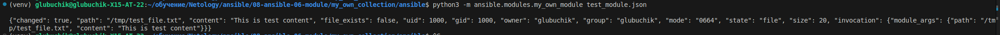
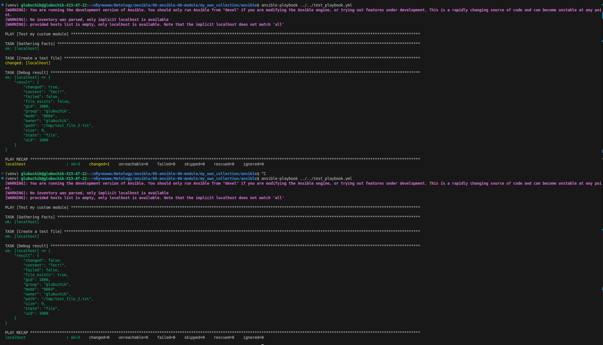
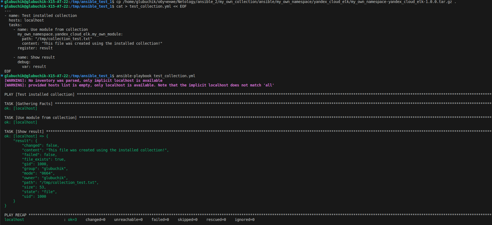

# Домашнее задание к занятию 6 «Создание собственных модулей»

## Подготовка к выполнению

1. Создайте пустой публичный репозиторий в своём любом проекте: `my_own_collection`.
2. Скачайте репозиторий Ansible: `git clone https://github.com/ansible/ansible.git` по любому, удобному вам пути.
3. Зайдите в директорию Ansible: `cd ansible`.
4. Создайте виртуальное окружение: `python3 -m venv venv`.
5. Активируйте виртуальное окружение: `. venv/bin/activate`. Дальнейшие действия производятся только в виртуальном окружении.
6. Установите зависимости `pip install -r requirements.txt`.
7. Запустите настройку окружения `. hacking/env-setup`.
8. Если все шаги прошли успешно — выйдите из виртуального окружения `deactivate`.
9. Ваше окружение настроено. Чтобы запустить его, нужно находиться в директории `ansible` и выполнить конструкцию `. venv/bin/activate && . hacking/env-setup`.

## Основная часть

Ваша цель — написать собственный module, который вы можете использовать в своей role через playbook. Всё это должно быть собрано в виде collection и отправлено в ваш репозиторий.

**Шаг 1.** В виртуальном окружении создайте новый `my_own_module.py` файл.

**Шаг 2.** Наполните его содержимым:

Или возьмите это наполнение [из статьи](https://docs.ansible.com/ansible/latest/dev_guide/developing_modules_general.html#creating-a-module).

**Шаг 3.** Заполните файл в соответствии с требованиями Ansible так, чтобы он выполнял основную задачу: module должен создавать текстовый файл на удалённом хосте по пути, определённом в параметре `path`, с содержимым, определённым в параметре `content`.

**Результат:**
[my_own_module.py](https://github.com/GlubuchikAr/my_own_collection/blob/main/ansible/lib/ansible/modules/my_own_module.py)

**Шаг 4.** Проверьте module на исполняемость локально.

**Результат:**
Создаем [test_module.json](https://github.com/GlubuchikAr/my_own_collection/blob/main/ansible/test_module.json)
Запускаем
```bash
python3 -m ansible.modules.my_own_module test_module.json

{"changed": true, "path": "/tmp/test_file.txt", "content": "This is test content", "file_exists": false, "uid": 1000, "gid": 1000, "owner": "glubuchik", "group": "glubuchik", "mode": "0664", "state": "file", "size": 20, "invocation": {"module_args": {"path": "/tmp/test_file.txt", "content": "This is test content"}}}
```

**Шаг 5.** Напишите single task playbook и используйте module в нём.

**Результат:** [test_playbook.yml](./test_playbook.yml)

**Шаг 6.** Проверьте через playbook на идемпотентность.

**Результат:**

Запускаем плэйбук первый раз:
```bash
ansible-playbook ../../test_playbook.yml
[WARNING]: You are running the development version of Ansible. You should only run Ansible from "devel" if you are modifying the Ansible engine, or trying out features under development. This is a rapidly changing source of code and can become unstable at any point.
[WARNING]: No inventory was parsed, only implicit localhost is available
[WARNING]: provided hosts list is empty, only localhost is available. Note that the implicit localhost does not match 'all'

PLAY [Test my custom module] **********************************************************************************************************************************************************

TASK [Gathering Facts] ****************************************************************************************************************************************************************
ok: [localhost]

TASK [Create a test file] *************************************************************************************************************************************************************
changed: [localhost]

TASK [Debug result] *******************************************************************************************************************************************************************
ok: [localhost] => {
    "result": {
        "changed": true,
        "content": "Тест!",
        "failed": false,
        "file_exists": false,
        "gid": 1000,
        "group": "glubuchik",
        "mode": "0664",
        "owner": "glubuchik",
        "path": "/tmp/test_file_2.txt",
        "size": 9,
        "state": "file",
        "uid": 1000
    }
}

PLAY RECAP ****************************************************************************************************************************************************************************
localhost                  : ok=3    changed=1    unreachable=0    failed=0    skipped=0    rescued=0    ignored=0   

```
Видим `"changed": true,`

Запускаем плэйбук второй раз
```bash
ansible-playbook ../../test_playbook.yml
[WARNING]: You are running the development version of Ansible. You should only run Ansible from "devel" if you are modifying the Ansible engine, or trying out features under development. This is a rapidly changing source of code and can become unstable at any point.
[WARNING]: No inventory was parsed, only implicit localhost is available
[WARNING]: provided hosts list is empty, only localhost is available. Note that the implicit localhost does not match 'all'

PLAY [Test my custom module] **********************************************************************************************************************************************************

TASK [Gathering Facts] ****************************************************************************************************************************************************************
ok: [localhost]

TASK [Create a test file] *************************************************************************************************************************************************************
ok: [localhost]

TASK [Debug result] *******************************************************************************************************************************************************************
ok: [localhost] => {
    "result": {
        "changed": false,
        "content": "Тест!",
        "failed": false,
        "file_exists": true,
        "gid": 1000,
        "group": "glubuchik",
        "mode": "0664",
        "owner": "glubuchik",
        "path": "/tmp/test_file_2.txt",
        "size": 9,
        "state": "file",
        "uid": 1000
    }
}

PLAY RECAP ****************************************************************************************************************************************************************************
localhost                  : ok=3    changed=0    unreachable=0    failed=0    skipped=0    rescued=0    ignored=0   

```
Видим `"changed": false,`

**Шаг 7.** Выйдите из виртуального окружения.

**Результат:** 
```
deactivate
```

**Шаг 8.** Инициализируйте новую collection: `ansible-galaxy collection init my_own_namespace.yandex_cloud_elk`.

**Результат:** 
```bash
ansible-galaxy collection init my_own_namespace.yandex_cloud_elk
[WARNING]: You are running the development version of Ansible. You should only run Ansible from "devel" if you are modifying the Ansible engine, or trying out features under development. This is a rapidly changing source of code and can become unstable at any point.
- Collection my_own_namespace.yandex_cloud_elk was created successfully
```

**Шаг 9.** В эту collection перенесите свой module в соответствующую директорию.

**Результат:** 
```bash
mkdir -p my_own_namespace/yandex_cloud_elk/plugins/modules
cp my_own_module.py my_own_namespace/yandex_cloud_elk/plugins/modules/
```

**Шаг 10.** Single task playbook преобразуйте в single task role и перенесите в collection. У role должны быть default всех параметров module.

**Результат:** 

[defaults](https://github.com/GlubuchikAr/my_own_collection/blob/main/my_own_namespace/yandex_cloud_elk/roles/create_file/defaults/main.yml)

[tasks](https://github.com/GlubuchikAr/my_own_collection/blob/main/my_own_namespace//yandex_cloud_elk/roles/create_file/tasks/main.yml)

**Шаг 11.** Создайте playbook для использования этой role.

**Результат:** 
[site.yml](https://github.com/GlubuchikAr/my_own_collection/blob/main/my_own_namespace/yandex_cloud_elk/site.yml)

**Шаг 12.** Заполните всю документацию по collection, выложите в свой репозиторий, поставьте тег `1.0.0` на этот коммит.

**Шаг 13.** Создайте .tar.gz этой collection: `ansible-galaxy collection build` в корневой директории collection.

**Шаг 14.** Создайте ещё одну директорию любого наименования, перенесите туда single task playbook и архив c collection.

**Шаг 15.** Установите collection из локального архива: `ansible-galaxy collection install <archivename>.tar.gz`.

**Шаг 16.** Запустите playbook, убедитесь, что он работает.

**Шаг 17.** В ответ необходимо прислать ссылки на collection и tar.gz архив, а также скриншоты выполнения пунктов 4, 6, 15 и 16.

**Результат:** 

[collection](https://github.com/GlubuchikAr/my_own_collection)

[tar.gz архив](https://github.com/GlubuchikAr/my_own_collection/blob/main/my_own_namespace/yandex_cloud_elk/my_own_namespace-yandex_cloud_elk-1.0.0.tar.gz)





## Необязательная часть

1. Реализуйте свой модуль для создания хостов в Yandex Cloud.
2. Модуль может и должен иметь зависимость от `yc`, основной функционал: создание ВМ с нужным сайзингом на основе нужной ОС. Дополнительные модули по созданию кластеров ClickHouse, MySQL и прочего реализовывать не надо, достаточно простейшего создания ВМ.
3. Модуль может формировать динамическое inventory, но эта часть не является обязательной, достаточно, чтобы он делал хосты с указанной спецификацией в YAML.
4. Протестируйте модуль на идемпотентность, исполнимость. При успехе добавьте этот модуль в свою коллекцию.
5. Измените playbook так, чтобы он умел создавать инфраструктуру под inventory, а после устанавливал весь ваш стек Observability на нужные хосты и настраивал его.
6. В итоге ваша коллекция обязательно должна содержать: clickhouse-role (если есть своя), lighthouse-role, vector-role, два модуля: my_own_module и модуль управления Yandex Cloud хостами и playbook, который демонстрирует создание Observability стека.

---

### Как оформить решение задания

Выполненное домашнее задание пришлите в виде ссылки на .md-файл в вашем репозитории.

---
